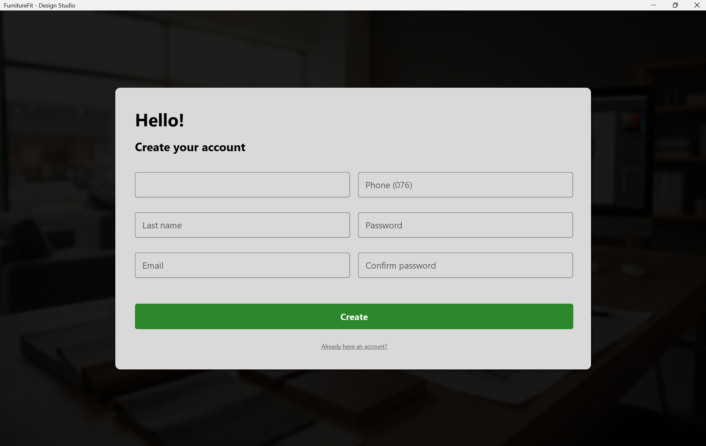
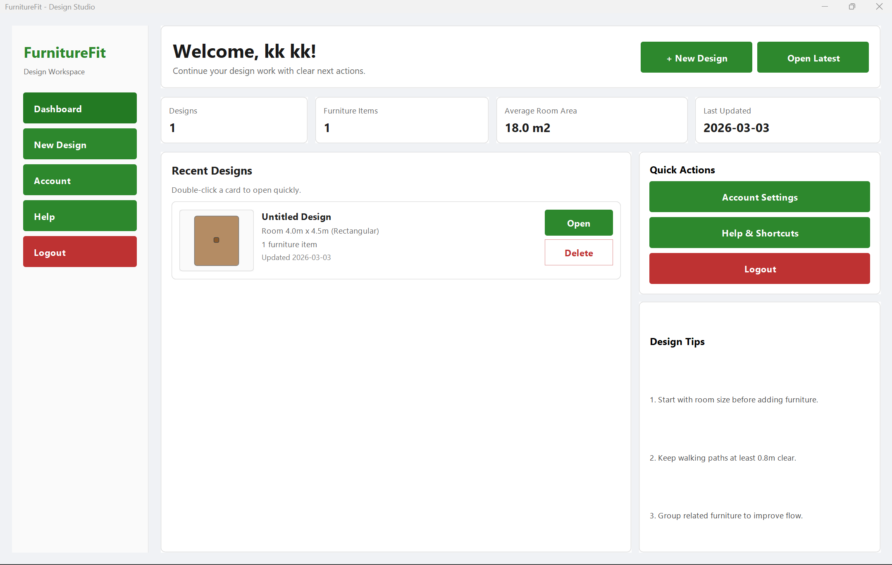
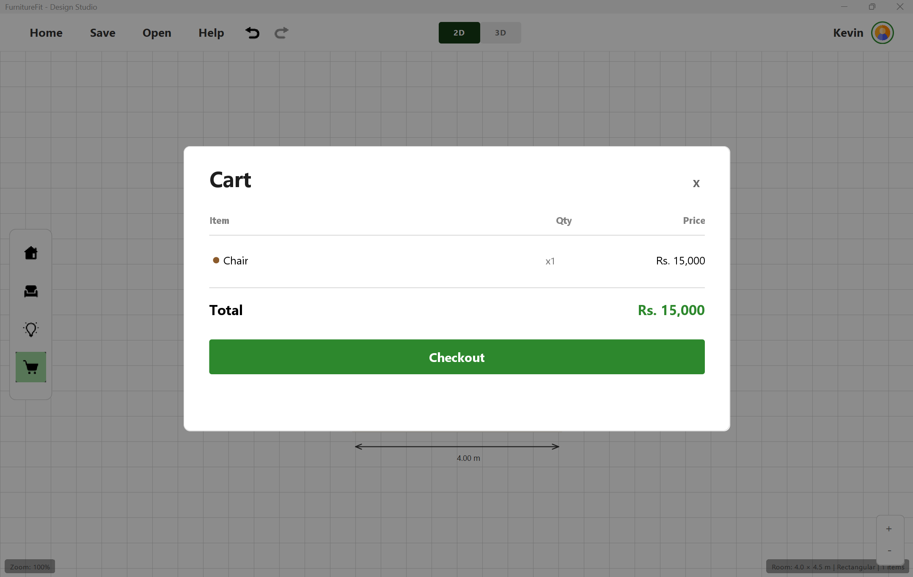
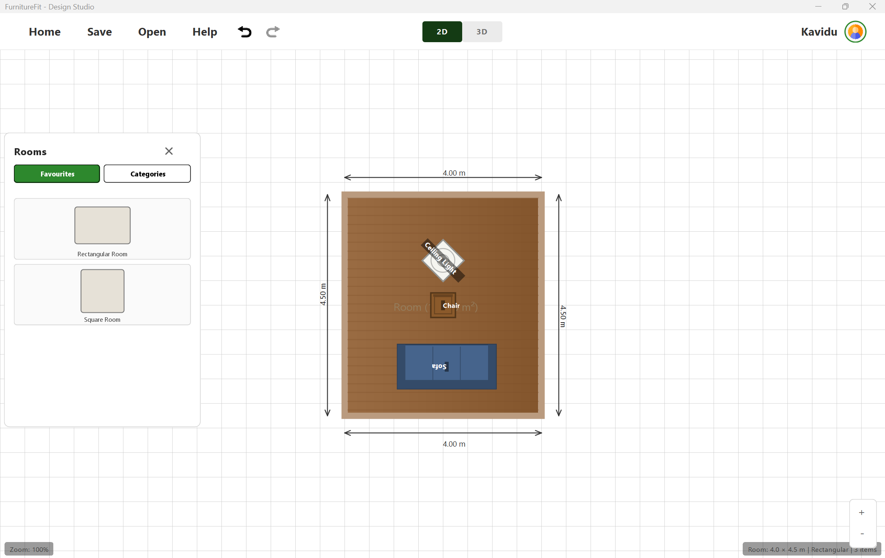
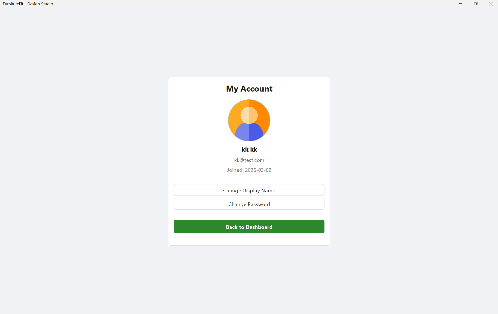
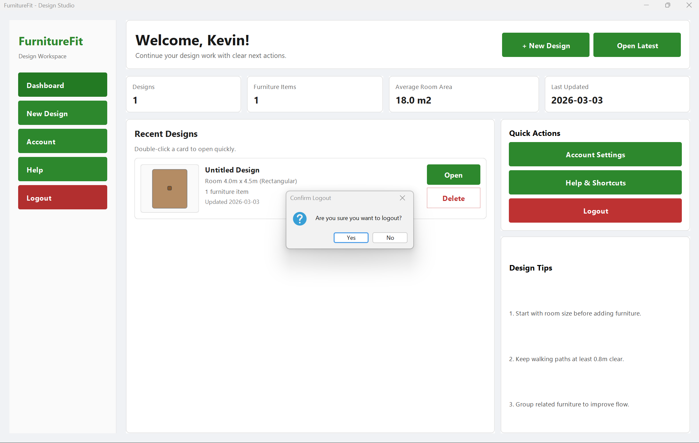
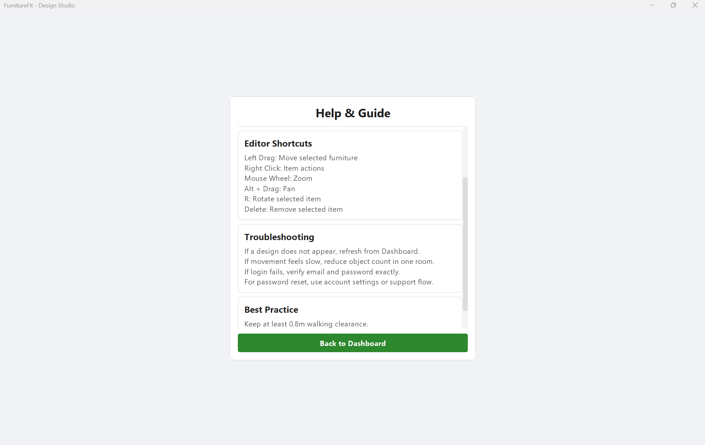
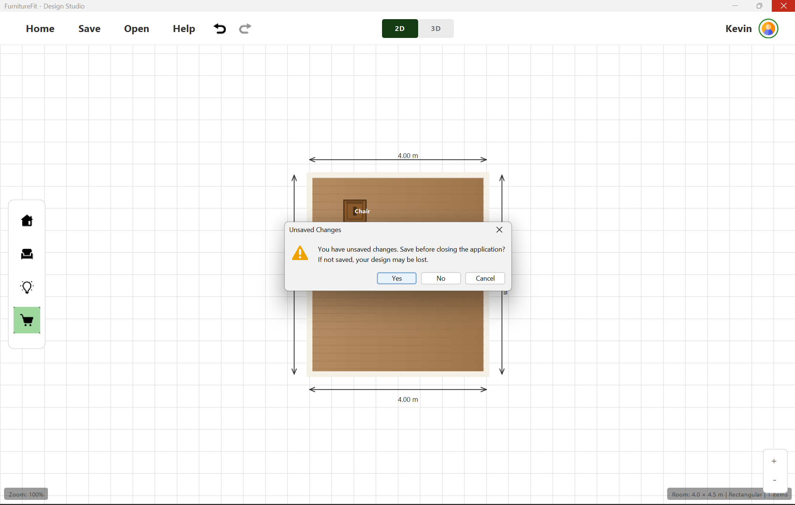

# FurnitureFit - UI Screenshots

Welcome to the FurnitureFit UI Screenshots gallery! This document showcases all the user interface elements and features of the FurnitureFit application.

---

## Table of Contents

1. [Authentication](#authentication)
2. [Dashboard](#dashboard)
3. [Design Editor](#design-editor)
4. [2D View](#2d-view)
5. [3D View](#3d-view)
6. [Furniture Management](#furniture-management)
7. [Room Configuration](#room-configuration)
8. [Account & Settings](#account--settings)
9. [Help System](#help-system)
10. [Messages & Notifications](#messages--notifications)

---

## Authentication

### Login Screen

### Registration Screen

---

## Dashboard

### Main Dashboard

### Cart

---

## Design Editor

### Save Design

### Open Design

---

## 2D View

### Account Panel (2D)

### Help Panel (2D)

### Add Room

### Add Furniture

### Add Chair

### Add Light

---

## 3D View

### 3D View

### 3D Night Mode

---

## Furniture Management

### Furniture Picker

---

## Room Configuration

### Add Room Dialog

---

## Account & Settings

### Account Panel

### Change Display Name

### Change Password

### Logout

---

## Help System

### Help Panel

---

## Messages & Notifications

### Success Messages

### Warning Messages

---

## Sample Bill

### Printed Bill Sample

---

## Additional Screenshots

### Screenshot 2026-03-06 143856

---

*For more information about FurnitureFit, visit the [main README](../../../../README.md)*

